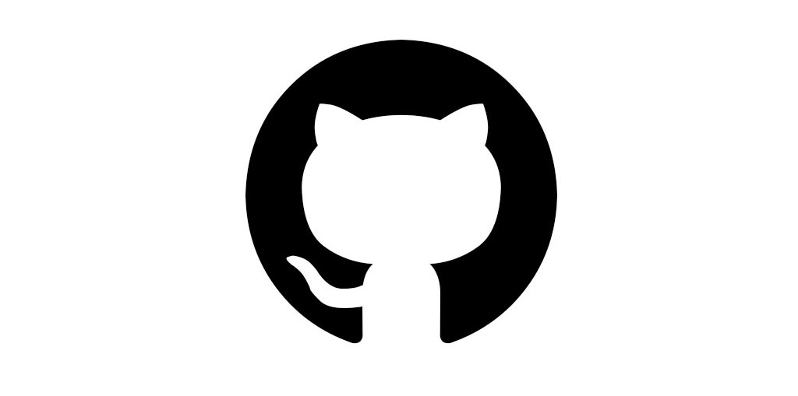
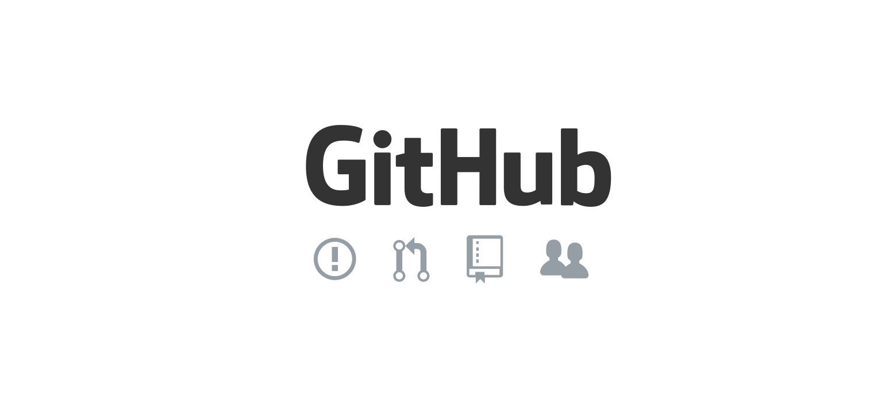
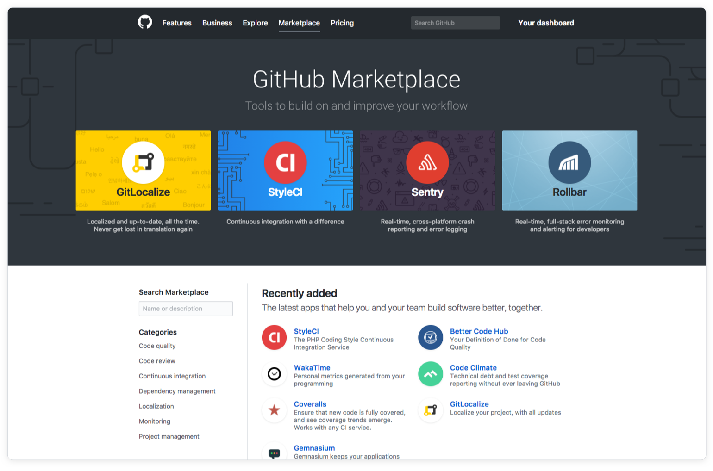
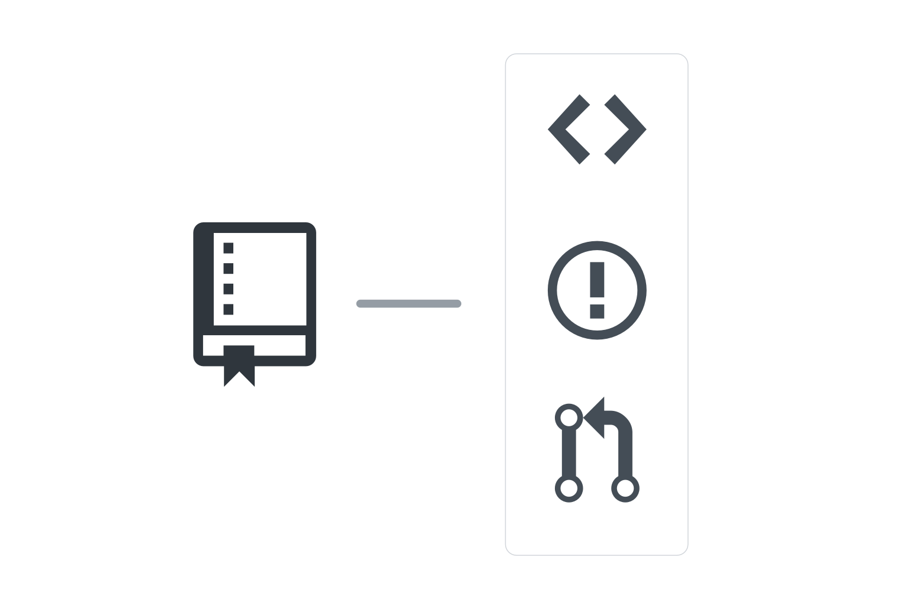

## コラボレーションの学習の開始

まず、Git、GitHub、そしてクラス全体で使用するコラボレーション機能を紹介します。 GitHubを使ったことがある人についても、この情報によって、より優れたソフトウェアの構築方法の基礎知識をお伝えできれば幸いです。

### GitHubとは何か

GitHubは、Gitと呼ばれる分散型バージョン管理システム上に構築されたコラボレーションプラットフォームです。

GitHubは、Gitプロジェクトをホストし共有する場所です。加えて、GitHubは、ユーザとそのチームによる効果的なコラボレーションに役立つ多くの機能を提供します。 たとえば、次のような機能です。

- Issues（イシュー）
- Pull requests（プルリクエスト）
- Projects（プロジェクト）
- Organization（オーガナイゼーション）およびTeam（チーム）

### GitHub Ecosystemについて

GitHubは、あなたに「画一的な」ecosystem（体系）を強制するのではなく、あなた好みのツールが揃っている場所になろうと努力しています。 インテグレーションの詳細については、<https://github.com/integrations>を参照してください。

継続的インテグレーション、依存関係のマネジメント、コード品質向上などに役立つ、これまでになかった必須ツールが見つかるかもしれません。

### Gitとは何か

#### Gitとは

- 分散型バージョン管理システムまたは DVCSと呼ばれている
- 無料かつオープンソース
- どのようなプロジェクト（小規模～非常に大規模）に対しても、迅速かつ効率的に対応できるよう設計
- 学習が簡単で、高速なパフォーマンスが得られ、資源の占有が少ない

Gitは、手間なく使えるローカルブランチ、便利なステージングエリア、複数のワークフローを備えています。

Gitについて（そしてGitを特別なものとしている特徴）をお話しするにあたって、少しの間、他のバージョン管理システム（VCS）に関する知識を全て忘れていただければ助かります。 Gitは、他のVCSとはまったく異なる方法で、情報について管理し、判断するのです。

クラスが進むにつれて、Gitがユーザのコードをどのように保管するのかを学習します。ですが、まずは、Gitがユーザのコンテンツとどのように連携するのかを理解しなければなりません。

#### スナップショットであり、差分ではない

最初に理解しておくべきことの１つは、Gitは、ユーザの情報について、変更の連鎖としての情報は保存しないということです。 かわりに、Gitは、その時点のリポジトリのスナップショットを取得します。 このスナップショットを、コミットと呼びます。

#### ローカルでの作業のための最適化

Gitは、ローカルでの作業のために最適化されています。 リポジトリのコピーをユーザがローカル環境にクローンすることで、リポジトリ全体とその履歴がコピーされます。 つまり、飛行機や鉄道に乗っている時、その他どのような場所においても作業をすることができます。

#### 軽量で負荷の少ないブランチ

ブランチは、Gitに欠かせない概念です。

Gitで新規ブランチを作成した場合、実際には、一連の作業における最新のスナップショットに対応するポインタを作成したことになります。 Gitは、メインの作業ラインへのスナップショットのマージをユーザが指示するまで、ブランチのスナップショットを別々で保存します。

#### 分かりやすいGit

説明が最後になりましたが、Gitはとても分かりやすいシステムです。 ユーザが指示するまで、一切の処理を行いません。 オートセーブやリモートとの自動同期は行いません。Gitは、ユーザがスナップショットを取得しリモートに送る指示を下すのを待つのです。

### GitHubリポジトリについて調べる

リポジトリは、GitHubの最も基本的な要素です。 プロジェクトのフォルダと捉えるのが、最も分かりやすいでしょう。 しかし、パソコン上の通常のフォルダとは異なり、GitHubリポジトリは、他人とのコラボレーションのためのシンプルで強力なツールを用意しています。

リポジトリには、ドキュメントを含むすべてのプロジェクト用ファイルが保管されており、各ファイルのリビジョン履歴が保存されます。 単に知りたいだけの人にとっても、優れたコントリビュータにとっても、リポジトリの関連要素を知ることは、とても重要です。

### ユーザアカウントと オーガナイゼーションアカウントの比較

GitHubには、User Account（ユーザアカウント）とOrganization Account（オーガナイゼーションアカウント）の２種類のアカウントがあります。 この２種類のアカウントは多くの点で異なりますが、大きな違いは、権限の処理方法です。

#### ユーザアカウント

GitHubにサインアップした時、ユーザアカウントが自動的に与えられています。 ユーザアカウントについての権限処理は簡単です。要は、他のユーザをコラボレータとして特定のリポジトリに追加し、プロジェクトに対する無制限の読み取り権限および書き込み権限を付与するのです。

#### オーガナイゼーションアカウント

オーガナイゼーションアカウントは、リポジトリに関する権限を、より細かく管理することができます。 オーガナイゼーションアカウントでは、複数のユーザでチームを結成し、特定のリポジトリへのアクセス権を付与します。 チームレベルで、読み取り権限、書き込み権限、管理者権限などを付与することができます。

### リポジトリのナビゲーション

#### Code（コード）

code view（コードビュー）では、リポジトリに含まれるファイルが表示されます。 これらのファイルには、プロジェクトコード、ドキュメント、およびその他の重要なファイルが含まれている場合があります。 このビューは、プロジェクトのルートとも呼びます。 このファイルに対する変更は、Gitのバージョン管理によって記録されます。

#### Issues（イシュー）

Issuesは、バグや機能の要求を記録するために使用されます。 Issuesは、チームの特定メンバーに割り当てることができます。話し合いやコラボレーション作業を促進するために設計されました。

#### Pull requests（プルリクエスト）

Pull Requestsは、作者がリポジトリに対して行いたい、ファイルの追加、変更、削除などの変更を表します。 Pull Requestは、コードレビューを容易にし、自動化されたテストのステータスを示すことで、より良いソフトウェアを作成するのに役立ちます。

#### Projects（プロジェクト）

Projectsでは、かんばん方式のボードを用いて、作業を視覚化することができます。 プロジェクトは、リポジトリまたはオーガナイゼーションレベルで作成することができます。

#### Wiki（ウィキ）

GitHubのWikiは、プロジェクトの詳細を伝えたり、ユーザのドキュメントを表示したり、様々なことを実行できます。 もちろん、ユーザのWikiの編集履歴の保管にもGitHubが役立ちます。

#### Pulse（パルス）

Pulseは、プロジェクトのダッシュボードです。 完了した作業と作業中の情報が含まれています。

#### Graphs（グラフ）

Graphsは、リポジトリでの作業をより詳細に表示にします。例えば、コントリビュートしたユーザ、作業予定、リポジトリをフォークしたユーザなどを表示します。

#### README.md

README.mdは、特別なファイルで、すべてのリポジトリに含めることをおすすめします。 GitHubはこのファイルを探し、参考としてリポジトリの下に表示します。 README では、プロジェクトについて説明し、プロジェクトにとって有益な情報を提供することをおすすめします。

#### CONTRIBUTING.md

CONTRIBUTING.mdは、もう１つの特別なファイルで、リポジトリでのコラボレーション作業を明記するために使用されます。 CONTRIBUTING.mdへのリンクは、ユーザが新しくIssueまたはPull Requestを作成しようとした時に表示されます。

#### ISSUE_TEMPLATE.md

ISSUE_TEMPLATE.md (および対となるPull Requestテンプレート)は、Issueのためのテンプレート化されたスターターテキストを生成するために使用されます。 誰かがIssueを作成した場合、テンプレート内の内容が、本文にあらかじめ入力されます。

### GitHubのIssuesの使い方

Githubでは、アイデア、改善策、課題やバグを記録し、これについて議論するためにIssueを使用します。 Issueによって、コラボレーション作業が次のようにスムーズになります。

- メールの代わりとしてプロジェクトを議論するために使用でき、現在および将来において、チームの全員が議論のすべての内容を確実に把握できる。
- 関連するIssueおよびPull Requestを、ユーザがクロスリンクできる。
- ユーザが行った判断の過程および理由について、包括的な単一の記録を作成できる。
- @メンションやチームのメンションを用いて、適当なユーザを会話に誘うことができる。

[include](02a_activity_create_github_issue.md ':include')

### Markdownの使用

GitHubは**Markdown**という記法を使用しており、Issue、Pull Requestや`.md` の拡張子のファイルに、基本的なテキストフォーマットを追加するのに役立ちます。

### よく使用するMarkdown構文

#### `# Header`

`#` は、ヘッダを表します。 （例）# = Header 1　## = Header 2

#### `* List item`

後にスペースを伴う `*` または `-` は、箇条書きリストを作成します。

#### `**Bold item**`

文字列の両側に2つのアスタリスク ` ** ` を付けると、そのテキストが太字になります。

#### `- [ ] Checklist`

`-`の次にスペース、そして、`[ ]`を付けることで、IssueまたはPull Requestに、便利なチェックリストを作成します。

#### `@mention`

Issueで他のユーザに@メンションすると、そのユーザがたとえ、そのIssueをsubscribeしていなくても、または、リポジトリをWatchしていなくても、通知が届きます。

#### `#975`

`#`の次にスペースなしで、同じリポジトリのIssueまたはPull Requestの数字を付けることで、クロスリンクを作成します。

#### `:smiley:`

口調は、文字によるコミュニケーションには現れません。 GitHubでは、コメントに絵文字を加えることができます。 絵文字のIDを `:`で囲むだけです。

### GitHub Pagesの概要

GitHub Pagesによって、静的なホームページをGitHubのリポジトリから無料で直接ホストすることができます。 クラスで使用するいくつかのプロジェクトでは、デプロイの手段としてGitHub Pagesを使用します。 このクラスではGitHub Pagesについてほとんど触れませんが、次の２点は知っておくべきです。

- ユーザは、２種類のサイトを作成できます。User/Organizationサイト、または、Projectサイトです。 私たちは、Projectサイトで作業します。
- Projectサイトについては、GitHubは、特定のブランチについてのみ、コンテンツを提供します。 なお、リポジトリの設定に応じて、`main` もしくは `gh-pages` ブランチ、または `main` ブランチの`/docs` フォルダから提供します。
- プロジェクトのためのレンダリングされたサイトは、`githubschool.github.io/repo-name`に表示されます。
