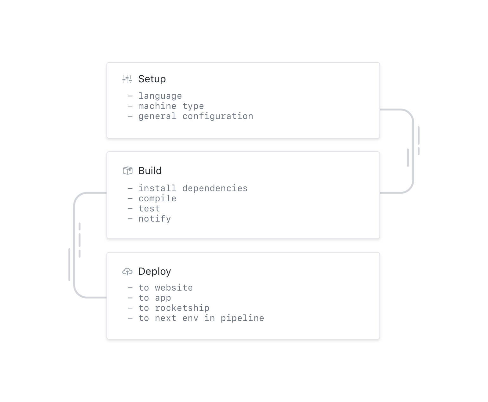

## `.yml`ファイルを理解する

前のセクションでは、`.yml` ファイルに変更を加えましたが、その具体的な機能と意味はなんでしょうか？

プロジェクトをテストするには、CIサービスプロバイダーが、コードに実行するテスト及び、テストされるビルド環境の仕様情報を知る必要があります。 設定をコードから自動的に察知できるプロバイダもあれば、詳細な仕様が必要なプロバイダもあります。 上記の仕様は、`<service-provider>.yml` ファイルに保存されており、プロジェクトの他の部分と同様に、バージョン管理下に置かれます。

`.yml` ファイルは、3つの主要な部分を持つ、To Doリストのようなものです。

- 環境のセットアップ
- テスト実行
- デプロイメント

他にも、上記の主要な部分の一部として、さまざまなステップがあります。 ビルドの前やその一部として、もしくは、ビルドとテストのアウトプットや結果に基づいて実行したいスクリプトがあれば、それも可能です。 `.yml` ファイルの内容は、サービスプロバイダによって異なるので、`.yml` を作成するときに、各プロバイダのドキュメントを参照すると良いです。

> 注釈：私たちが使用する例は比較的単純ですが、テスト環境の機能性はこれらの例よりもはるかに深いものになります。 テスト環境の目的は、できる限りプロダクション環境に近づけてテストすることです。 可能性は無限大です。複数のバージョンや言語、環境とマシーンをテストしたければ、全て可能です！ 前述したとおり、.yml ファイルの扱いは各 CI ベンダによって異なるので、テストを行う `.yml` ファイルを作成するときは、そのプロバイダのドキュメントを参照しましょう。
