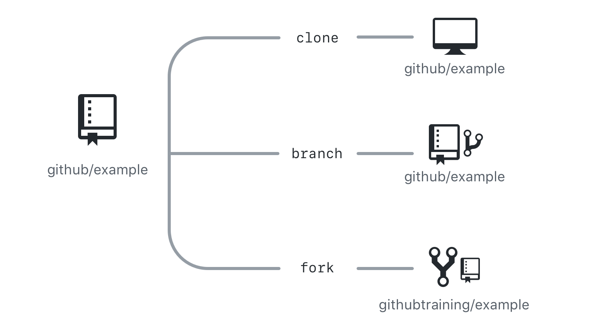
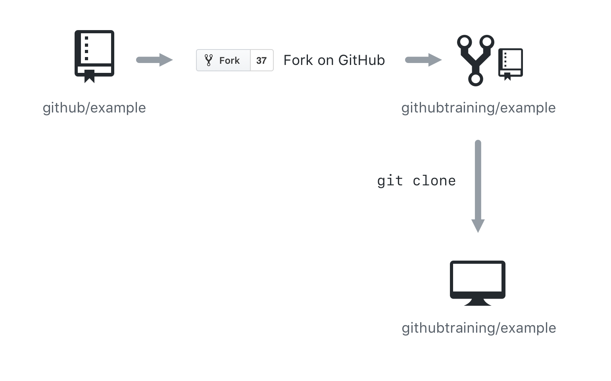

## フォークとプルのワークフロー

Gitの使用言語を区別し、フォークに関する共通のワークフローを論じてみましょう。

通常、下の写真のように１つの親リポジトリから作業を開始します。 これを、 **親**（parent）リポジトリと呼びます。ですが、*どのように*作業するかによって、別の名前で呼ぶこともあります。

例えば、パソコン上にローカルコピーを作成することで、リポジトリを**クローン**（clone）する場合は、そのオリジナルのリモートリポジトリを **origin**と表します。

ブランチは、ローカルの**クローン**で作成でき、 *かつ *、リモートの**origin**で作成できます。

フォークについては、話が少し複雑になります。 **フォーク**（fork）は、別のオーナーのリポジトリのリモートコピーです。 新しいリモート**フォーク**があるとき、親リモートを**上流**（upstream）と表します。

フォークをクローンした場合は、自分のフォークを**origin**と表し 、親を**上流**と表します。

**origin**または**上流**のリポジトリに作業内容を戻したい場合は、**origin**にプッシュし、リモートフォーク間のPull Requestを開きます。

